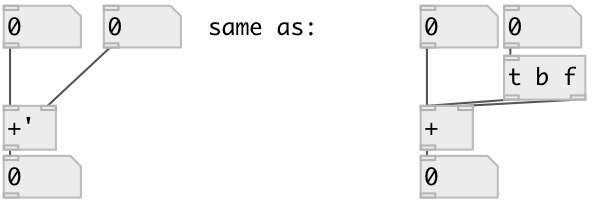

[index](index.html) :: [math](category_math.html)
---

# math.sync_add

###### sync addition

*доступно с версии:* 0.8

---

## аргументы:

* **F**
second addend 
_тип:_ float 

## свойства:

* **@int** 
Получить/установить operate on integers only 
_тип:_ flag 
_по умолчанию:_ 0 

## входы:

* set first addend, calculate and output result 
_тип:_ control
* change second addend, calculate and output result 
_тип:_ control

## выходы:

* result output 
_тип:_ control

## ключевые слова:

[math](keywords/math.html)
[add](keywords/add.html)
[sync](keywords/sync.html)

**Смотрите также:**
[\[math.sync_sub\]](math.sync_sub.html)

**Авторы:** Serge Poltavsky

**Лицензия:** GPL3 or later

