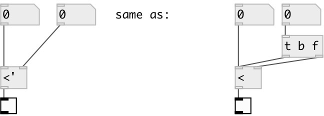

[index](index.html) :: [math](category_math.html)
---

# math.sync_lt

###### sync less then numbers compare

*доступно с версии:* 0.8

---

## аргументы:

* **F**
second number 
_тип:_ float 

## входы:

* set first number, calculate and output result 
_тип:_ control
* change second number, calculate and output result 
_тип:_ control

## выходы:

* result output: 1 if first number is less then second, otherwise 0 
_тип:_ control

## ключевые слова:

[math](keywords/math.html)
[sync](keywords/sync.html)
[less](keywords/less.html)
[then](keywords/then.html)

**Смотрите также:**
[\[math.&gt;&#39;\]](math.%3E%27.html)

**Авторы:** Serge Poltavsky

**Лицензия:** GPL3 or later

