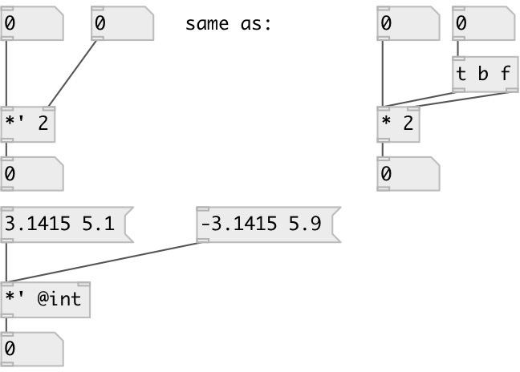

[index](index.html) :: [math](category_math.html)
---

# math.sync_mul

###### sync multiplication

*доступно с версии:* 0.8

---

## аргументы:

* **MUL**
multiplicand 
_тип:_ float 

## свойства:

* **@int** 
Получить/установить operate on integers only 
_тип:_ flag 
_по умолчанию:_ 0 

## входы:

* set multiplier, calculate and output result 
_тип:_ control
* change multiplicand, calculate and output result 
_тип:_ control

## выходы:

* multiplication result 
_тип:_ control

## ключевые слова:

[math](keywords/math.html)
[mul](keywords/mul.html)
[sync](keywords/sync.html)

**Авторы:** Serge Poltavsky

**Лицензия:** GPL3 or later

