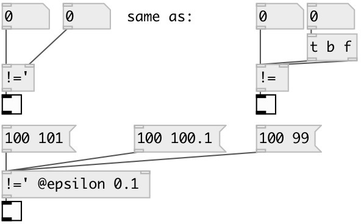

[index](index.html) :: [math](category_math.html)
---

# math.sync_ne

###### sync numbers for not equality

*доступно с версии:* 0.8

---

## аргументы:

* **F**
second number 
_тип:_ float 

## свойства:

* **@epsilon** 
Получить/установить compare epsilon. If not zero calculates expession: !(-epsilon &lt; abs(A-B) &lt;
+epsilon) 
_тип:_ float 
_минимальное значение:_ 0 
_по умолчанию:_ 0 

## входы:

* set first number, calculate and output result 
_тип:_ control
* change second number, calculate and output result 
_тип:_ control

## выходы:

* result output: 1 if numbers are not equal otherwise 0 
_тип:_ control

## ключевые слова:

[math](keywords/math.html)
[sync](keywords/sync.html)
[not](keywords/not.html)
[equal](keywords/equal.html)

**Смотрите также:**
[\[math.==&#39;\]](math.%3D%3D%27.html)

**Авторы:** Serge Poltavsky

**Лицензия:** GPL3 or later

