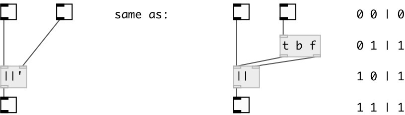

[index](index.html) :: [math](category_math.html)
---

# math.sync_or

###### sync logical OR operation

*доступно с версии:* 0.8

---

## информация
Only 1 and 0 values are accepted. Any other number treat as 1, but print error to console.

## аргументы:

* **V**
second value 
_тип:_ int 

## входы:

* set first value, calculate and output result 
_тип:_ control
* change second value, calculate and output result 
_тип:_ control

## выходы:

* output 1 or 0, according logical OR operation 
_тип:_ control

## ключевые слова:

[math](keywords/math.html)
[sync](keywords/sync.html)
[logical](keywords/logical.html)
[or](keywords/or.html)

**Смотрите также:**
[\[math.&amp;&amp;&#39;\]](math.%26%26%27.html)

**Авторы:** Serge Poltavsky

**Лицензия:** GPL3 or later

