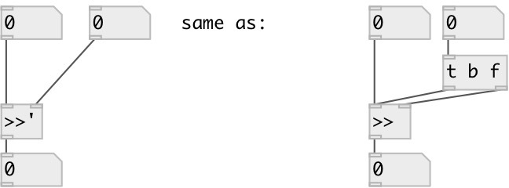

[index](index.html) :: [math](category_math.html)
---

# math.sync_rshift

###### sync signed bit right shift

*доступно с версии:* 0.9.1

---

## аргументы:

* **SHIFT**
shift amount 
_тип:_ int 

## входы:

* set value, calculate and output result 
_тип:_ control
* change shift, calculate and output result 
_тип:_ control

## выходы:

* result output 
_тип:_ control

## ключевые слова:

[math](keywords/math.html)
[shift](keywords/shift.html)
[sync](keywords/sync.html)

**Смотрите также:**
[\[math.sync_lshift\]](math.sync_lshift.html)

**Авторы:** Serge Poltavsky

**Лицензия:** GPL3 or later

