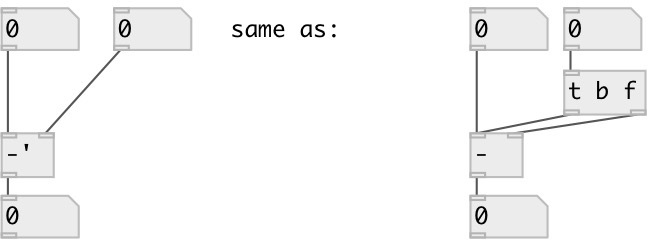

[index](index.html) :: [math](category_math.html)
---

# math.sync_sub

###### sync subtraction

*доступно с версии:* 0.8

---

## аргументы:

* **F**
subtrahend 
_тип:_ float 

## свойства:

* **@int** (initonly)
Запросить/установить operate on integers only 
_тип:_ flag 
_по умолчанию:_ 0 

## входы:

* set minuend, calculate and output result 
_тип:_ control
* change subtrahend, calculate and output result 
_тип:_ control

## выходы:

* difference output 
_тип:_ control

## ключевые слова:

[math](keywords/math.html)
[sub](keywords/sub.html)
[sync](keywords/sync.html)

**Смотрите также:**
[\[math.sync_add\]](math.sync_add.html)

**Авторы:** Serge Poltavsky

**Лицензия:** GPL3 or later

