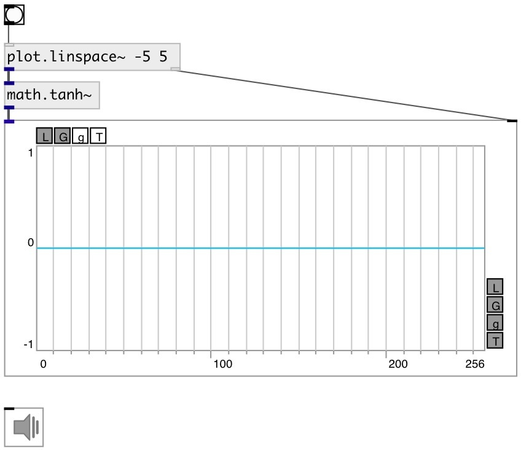

[index](index.html) :: [math](category_math.html)
---

# math.tanh~

###### hyperbolic tangent for signals

*доступно с версии:* 0.9

---

## информация
Outputs hyperbolic tangent of input signal

## входы:

* input signal 
_тип:_ audio

## выходы:

* result signal 
_тип:_ audio

## ключевые слова:

[math](keywords/math.html)
[hyperbolic](keywords/hyperbolic.html)
[tangent](keywords/tangent.html)

**Смотрите также:**
[\[math.atanh~\]](math.atanh~.html)
[\[math.tanh\]](math.tanh.html)

**Авторы:** Serge Poltavsky

**Лицензия:** GPL3 or later

