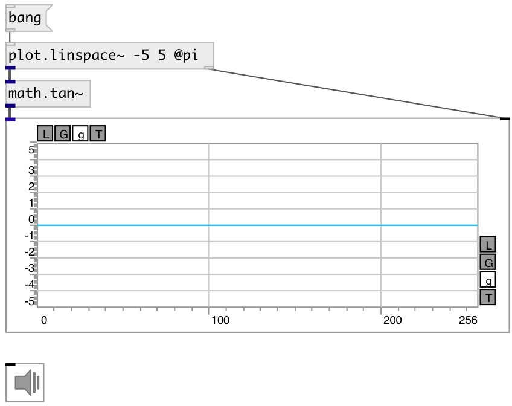

[index](index.html) :: [math](category_math.html)
---

# math.tan~

###### tangent function

*доступно с версии:* 0.9

---

## информация
Outputs the tangent of x (measured in radians).

## входы:

* input signal 
_тип:_ audio

## выходы:

* result signal 
_тип:_ audio

## ключевые слова:

[math](keywords/math.html)
[tan](keywords/tan.html)

**Смотрите также:**
[\[math.tan~\]](math.tan~.html)
[\[math.asin\]](math.asin.html)
[\[math.atan\]](math.atan.html)

**Авторы:** Serge Poltavsky

**Лицензия:** GPL3 or later

