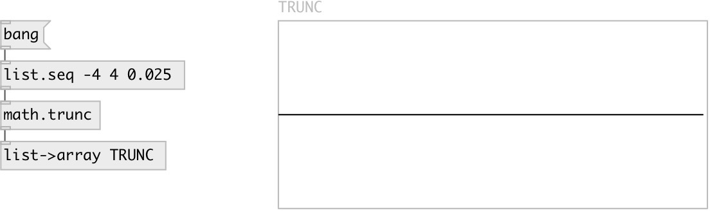

[index](index.html) :: [math](category_math.html)
---

# math.trunc

###### truncate to integer value

*доступно с версии:* 0.1

---

## информация
Outputs the integral value nearest to but no larger in magnitude than x

## входы:

* input signal 
_тип:_ control

## выходы:

* result signal 
_тип:_ control

## ключевые слова:

[math](keywords/math.html)
[trunc](keywords/trunc.html)

**Смотрите также:**
[\[math.ceil\]](math.ceil.html)
[\[math.floor\]](math.floor.html)
[\[math.round\]](math.round.html)

**Авторы:** Serge Poltavsky

**Лицензия:** GPL3 or later

