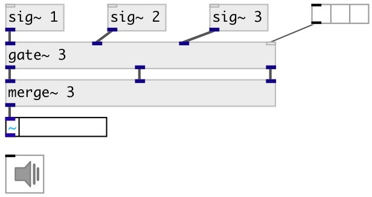

[index](index.html) :: [base](category_base.html)
---

# merge~

###### parametrized signal merge

*доступно с версии:* 0.9.7

---

## информация
mostly syntax sugar for clear schemes, but can be used in dynamic pathing

## аргументы:

* **N**
number of inputs 
_тип:_ int 

## свойства:

* **@n** (initonly)
Запросить/установить number of inputs 
_тип:_ int 
_диапазон:_ 2..64 
_по умолчанию:_ 2 

## входы:

* first input signal 
_тип:_ audio
* ... input signal 
_тип:_ audio
* n-th input signal 
_тип:_ audio

## выходы:

* output 
_тип:_ audio

## ключевые слова:

[merge](keywords/merge.html)
[split](keywords/split.html)

**Смотрите также:**
[\[split~\]](split~.html)

**Авторы:** Serge Poltavsky

**Лицензия:** GPL3 or later

