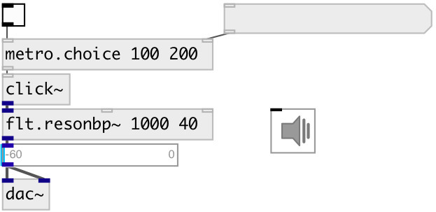

[index](index.html) :: [base](category_base.html)
---

# metro.choice

###### metro with random choice from timeset

*доступно с версии:* 0.9.7

---

## информация
Random distribution: uniform

## аргументы:

* **TIMESET**
timeset (&gt;0) 
_тип:_ list 
_единица:_ ms 

## свойства:

* **@timeset** 
Запросить/установить timeset (&gt;0) 
_тип:_ list 
_единица:_ ms 

* **@seed** 
Запросить/установить generator seed 
_тип:_ int 
_минимальное значение:_ 0 
_по умолчанию:_ 0 

## входы:

* starts (on &gt;0) or stops (on &lt;=0) metro 
_тип:_ control
* set timeset 
_тип:_ control

## выходы:

* outputs *bang* 
_тип:_ control

## ключевые слова:

[metro](keywords/metro.html)
[random](keywords/random.html)

**Смотрите также:**
[\[metro.random\]](metro.random.html)
[\[metro.pattern\]](metro.pattern.html)

**Авторы:** Serge Poltavsky

**Лицензия:** GPL3 or later

