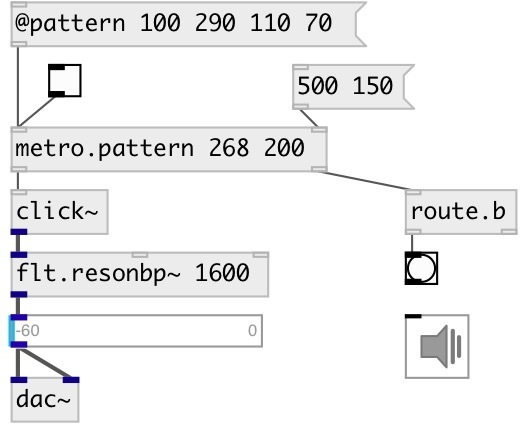

[index](index.html) :: [base](category_base.html)
---

# metro.pattern

###### метроном с ритмическими паттернами

*доступно с версии:* 0.5

---

## аргументы:

* **PATTERN**
list of time intervals (in ms) 
_тип:_ list 

## свойства:

* **@current** 
Запросить/установить current pattern index 
_тип:_ int 
_минимальное значение:_ 0 
_по умолчанию:_ 0 

* **@pattern** 
Запросить/установить time intervals (in ms) performed in a loop 
_тип:_ list 

* **@sync** 
Запросить/установить sync mode - change pattern after full cycle 
_тип:_ bool 
_по умолчанию:_ 0 

## входы:

* starts (on 1) or stops (on 0) metro 
_тип:_ control
* set new pattern 
_тип:_ control

## выходы:

* outputs *bang* 
_тип:_ control
* outputs current pattern index and bang on each cycle 
_тип:_ control

## ключевые слова:

[metro](keywords/metro.html)
[pattern](keywords/pattern.html)
[rhythm](keywords/rhythm.html)

**Смотрите также:**
[\[metro\]](metro.html)
[\[metro.seq\]](metro.seq.html)

**Авторы:** Serge Poltavsky

**Лицензия:** GPL3 or later

