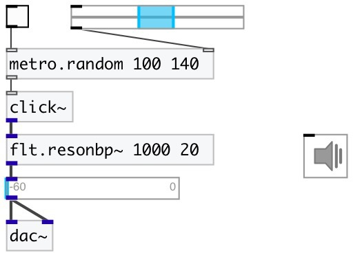

[index](index.html) :: [base](category_base.html)
---

# metro.random

###### metro random bang with specified range

*доступно с версии:* 0.9

---

## информация
Random distribution: uniform

## аргументы:

* **MIN**
minimal bang interval 
_тип:_ int 
_единица:_ ms 

* **MAX**
maximum bang interval 
_тип:_ int 
_единица:_ ms 

## свойства:

* **@min** 
Получить/установить minimal bang interval 
_тип:_ int 
_единица:_ ms 
_минимальное значение:_ 1 
_по умолчанию:_ 100 

* **@max** 
Получить/установить maximum bang interval 
_тип:_ int 
_единица:_ ms 
_минимальное значение:_ 1 
_по умолчанию:_ 200 

## входы:

* starts (on &gt; 0) or stops (on &lt;= 0) metro 
_тип:_ control
* set random range. min max pair expected. 
_тип:_ control

## выходы:

* outputs *bang* 
_тип:_ control

## ключевые слова:

[metro](keywords/metro.html)
[random](keywords/random.html)

**Смотрите также:**
[\[metro\]](metro.html)
[\[metro.pattern\]](metro.pattern.html)

**Авторы:** Serge Poltavsky

**Лицензия:** GPL3 or later

