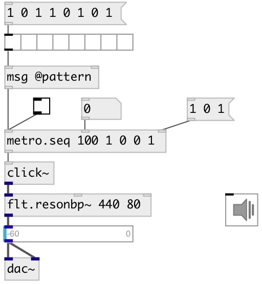

[index](index.html) :: [base](category_base.html)
---

# metro.seq

###### metro sequencer

*доступно с версии:* 0.5

---

## информация
Easy way to build beat machines

## аргументы:

* **INTERVAL**
metro tempo in ms 
_тип:_ float 
_единица:_ ms 

* **PATTERN**
list of 1 and 0. Where 1 means output bang on this beat 
_тип:_ list 

## свойства:

* **@pattern** 
Получить/установить list of 1 and 0. Where 1 means output bang on this beat 
_тип:_ list 

* **@interval** 
Получить/установить interval between beats 
_тип:_ float 
_единица:_ ms 
_минимальное значение:_ 1 
_по умолчанию:_ 0 

* **@current** 
Получить/установить current pattern index 
_тип:_ int 
_минимальное значение:_ 0 
_по умолчанию:_ 0 

## входы:

* starts (on 1) or stops (on 0) metro 
_тип:_ control

## выходы:

* outputs *bang* 
_тип:_ control

## ключевые слова:

[metro](keywords/metro.html)
[sequencer](keywords/sequencer.html)

**Смотрите также:**
[\[metro\]](metro.html)
[\[metro.pattern\]](metro.pattern.html)

**Авторы:** Serge Poltavsky

**Лицензия:** GPL3 or later

