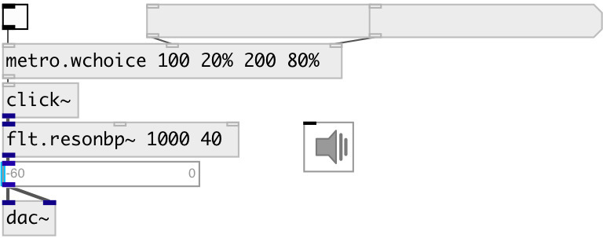

[index](index.html) :: [base](category_base.html)
---

# metro.wchoice

###### metro with weighted random choice from timeset

*доступно с версии:* 0.9.7

---

## аргументы:

* **INIT**
TIME and WEIGHT list in format: T0 W1... Weight values can be floats or percent 
_тип:_ list 

## свойства:

* **@t** 
Запросить/установить timeset (&gt;0) 
_тип:_ list 
_единица:_ ms 

* **@w** 
Запросить/установить weight list, float or percent values 
_тип:_ list 

* **@seed** 
Запросить/установить generator seed 
_тип:_ int 
_минимальное значение:_ 0 
_по умолчанию:_ 0 

* **@init** (initonly)
Запросить/установить intermixed list of time and weights values 
_тип:_ list 

* **@calc_w** (readonly)
Запросить normalized list of probabilities 
_тип:_ list 
_по умолчанию:_ 1 

## входы:

* starts (on &gt;0) or stops (on &lt;=0) metro 
_тип:_ control
* set timeset 
_тип:_ control
* set weights 
_тип:_ control

## выходы:

* outputs *bang* 
_тип:_ control

## ключевые слова:

[metro](keywords/metro.html)
[random](keywords/random.html)
[weight](keywords/weight.html)

**Смотрите также:**
[\[metro.choice\]](metro.choice.html)
[\[metro.random\]](metro.random.html)

**Авторы:** Serge Poltavsky

**Лицензия:** GPL3 or later

