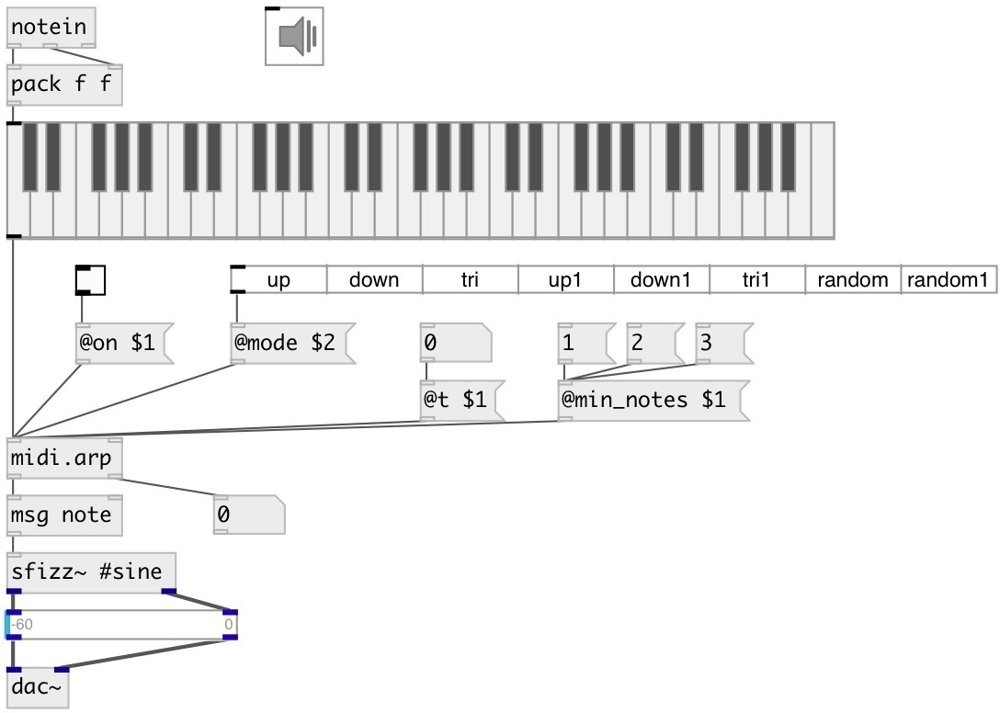

[index](index.html) :: [midi](category_midi.html)
---

# midi.arp

###### MIDI arpeggiator

*доступно с версии:* 0.9.6

---

## информация
&#39;up&#39; - play notes from bottom to up &#39;down&#39; - play from top to bottom &#39;tri&#39; - play from bottom to up and then back &#39;up1&#39; - play top note, then from bottom to up &#39;down1&#39; - play bottom note, then from top to bottom &#39;tri1&#39; - play from up to bottom, then back &#39;random&#39; - play random note, excluding the current one (no repeats) &#39;random1&#39; - play random note (there can be repeats)

## аргументы:

* **T**
time between arpeggio 
_тип:_ float 
_единица:_ ms 

## свойства:

* **@t** 
Запросить/установить time between arpeggio 
_тип:_ float 
_единица:_ ms 
_диапазон:_ 1..1000 
_по умолчанию:_ 100 

* **@mode** 
Запросить/установить argpeggiator mode 
_тип:_ symbol 
_варианты:_ up, down, tri, up1, down1, tri1, random, random1 
_по умолчанию:_ up 

* **@seed** 
Запросить/установить random seed value (to get reproducible random series) 
_тип:_ int 
_минимальное значение:_ 0 
_по умолчанию:_ 0 

* **@external** 
Запросить/установить use external clock 
_тип:_ bool 
_по умолчанию:_ 0 

* **@min_notes** 
Запросить/установить number of minimal notes to perform arpeggio 
_тип:_ int 
_минимальное значение:_ 1 
_по умолчанию:_ 1 

* **@on** 
Запросить/установить arpeggiator state: on/off 
_тип:_ bool 
_по умолчанию:_ 1 

* **@pass** 
Запросить/установить bypass arpeggiator 
_тип:_ bool 
_по умолчанию:_ 0 

## входы:

* NOTE VELOCITY 
_тип:_ control
* play next note in chord, if @external = 1 
_тип:_ control

## выходы:

* list: NOTE VELOCITY 
_тип:_ control
* int: note index in chord 
_тип:_ control

## ключевые слова:

[midi](keywords/midi.html)
[arpeggiator](keywords/arpeggiator.html)

**Авторы:** Serge Poltavsky

**Лицензия:** GPL3 or later

