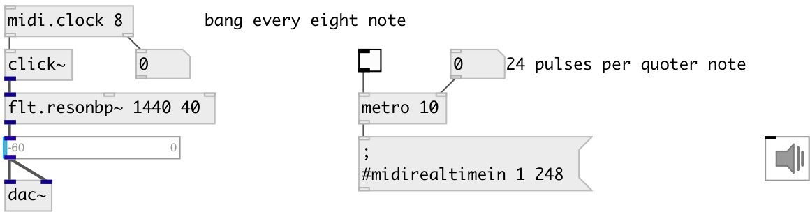

[index](index.html) :: [midi](category_midi.html)
---

# midi.clock

###### midi clock toolbox

*доступно с версии:* 0.9.2

---

## информация
Note: cause in Pd messages are processed between DSP blocks - measured bpm is not exact

## аргументы:

* **DIV**
@div clock subdivision 
_тип:_ int 

## методы:

* **reset**
reset beat counter 

## свойства:

* **@div** 
Запросить/установить clock subdivision. If 0: bang each incoming midi clock message, if 4: output
every quoter note, 8: every eight note etc. 
_тип:_ int 
_варианты:_ 0, 4, 8, 16, 32 
_по умолчанию:_ 0 

## входы:

* control input 
_тип:_ control

## выходы:

* bang: on specified beat 
_тип:_ control
* float: measured bpm (output every beat) 
_тип:_ control

## ключевые слова:

[midi](keywords/midi.html)
[clock](keywords/clock.html)

**Авторы:** Serge Poltavsky

**Лицензия:** GPL3 or later

