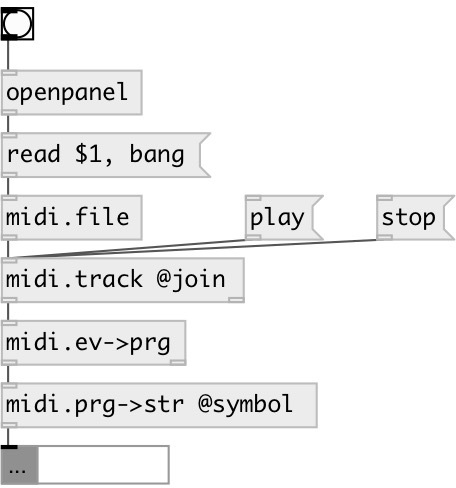

[index](index.html) :: [midi](category_midi.html)
---

# midi.event2prg

###### convert MidiEvent message to midi program change value

*доступно с версии:* 0.4

---

## входы:

* MidiEvent message 
_тип:_ control

## выходы:

* output MIDI patch number 
_тип:_ control

## ключевые слова:

[midi](keywords/midi.html)
[program](keywords/program.html)

**Авторы:** Serge Poltavsky

**Лицензия:** GPL3 or later

