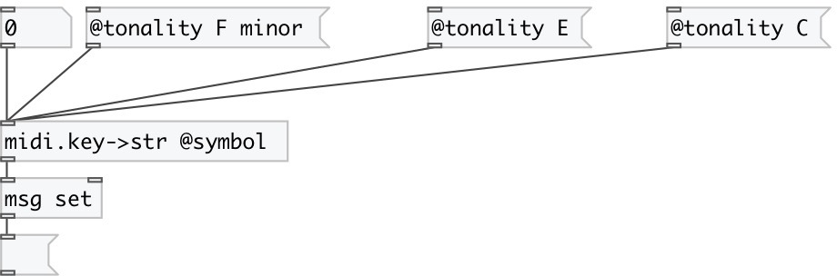

[index](index.html) :: [midi](category_midi.html)
---

# midi.key2str

###### преобразует номер MIDI-клавиши в имя ноты в формате SPN

*доступно с версии:* 0.4

---

## аргументы:

* **TONALITY**
initial tomality 
_тип:_ list 

## свойства:

* **@symbol** (initonly)
Запросить/установить output as symbol instead of string by default 
_тип:_ flag 
_по умолчанию:_ 0 

* **@tonality** 
Запросить/установить current tonality 
_тип:_ list 
_по умолчанию:_ C major 

## входы:

* standart MIDI key number [0-127] 
_тип:_ control

## выходы:

* output key name 
_тип:_ control

## ключевые слова:

[midi](keywords/midi.html)
[key](keywords/key.html)
[name](keywords/name.html)
[spn](keywords/spn.html)
[pitch](keywords/pitch.html)
[notation](keywords/notation.html)

**Авторы:** Serge Poltavsky

**Лицензия:** GPL3 or later

