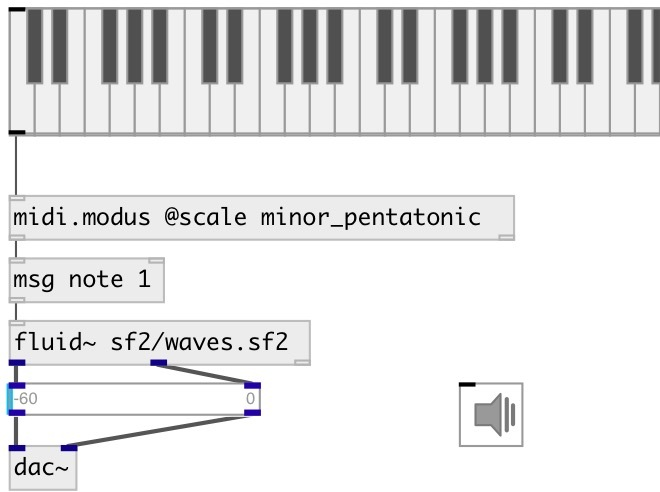

[index](index.html) :: [midi](category_midi.html)
---

# midi.modus

###### snap/skip midi pitches according modus

*доступно с версии:* 0.9.5

---

## аргументы:

* **ROOT**
root key 
_тип:_ atom 

* **SCALE**
modus scale 
_тип:_ symbol 

## свойства:

* **@root** 
Запросить/установить root key 
_тип:_ atom 
_варианты:_ Cbb, Cb, C, C#, C##, Dbb, Db, D, D#, D##, Ebb, Eb, E, E#, E##, Fbb, Fb, F, F#, F##, Gbb, Gb, G, G#, G##, Abb, Ab, A, A#, A##, Bbb, Bb, B, B#, B## 
_по умолчанию:_ C 

* **@scale** 
Запросить/установить modus scale 
_тип:_ symbol 
_варианты:_ ahirbhairav, indian, kurd, diminished2, partch_u6, gong, partch_o4, rast_desc, nairuz, hirajoshi, hex_major6, farahfaza, minor, pelog, partch_o3, partch_u1, partch_u3, yakah, kumoi, nikriz, yakah_desc, lydian, whole, ritusen, jiharkah, major_melodic, augmented2, locrian, mustar, mixolydian, nahawand, partch_o1, ionian, partch_u5, hex_dorian, nawa_athar, hex_aeolian, minor_harmonic, minor_melodic, yu, minor_melodic_desc, minor_lydian, zhi, dorian, sikah_desc, marva, hijaz, partch_o6, major_pentatonic, partch_u4, diminished, shang, partch_o5, whole_leading, iraq, major_harmonic, bartok, zamzam, super_locrian, chromatic24, ajam, prometheus, atharKurd, chinese, mahur, augmented, jiao, egyptian, suznak, hijaz_kar, saba, kijaz_kar_kurd, husseini, huzam, major_neapolitan, shawq_afza, hex_phrygian, minor_pentatonic, bastanikar, hex_sus, bayati, minor_romanian, major_locrian, rast, scriabin, major, murassah, ushaq_mashri, partch_u2, sikah, partch_o2, nahawand_desc, minor_hungarian, iwato, chromatic, aeolian, enigmatic, hindu, phrygian, zanjaran, karjighar, spanish, purvi, minor_neapolitan, bhairav, hijaz_desc, todi, hex_major7 
_по умолчанию:_ chromatic 

* **@mode** 
Запросить/установить snap or skip incoming pitches 
_тип:_ symbol 
_варианты:_ snap, skip 
_по умолчанию:_ snap 

## входы:

* note value 
_тип:_ control

## выходы:

* accepted note or NOTE VELOCITY [DUR] list 
_тип:_ control
* discarded message 
_тип:_ control

## ключевые слова:

[midi](keywords/midi.html)
[modus](keywords/modus.html)
[tonality](keywords/tonality.html)
[pitch](keywords/pitch.html)

**Авторы:** Serge Poltavsky

**Лицензия:** GPL3 or later

