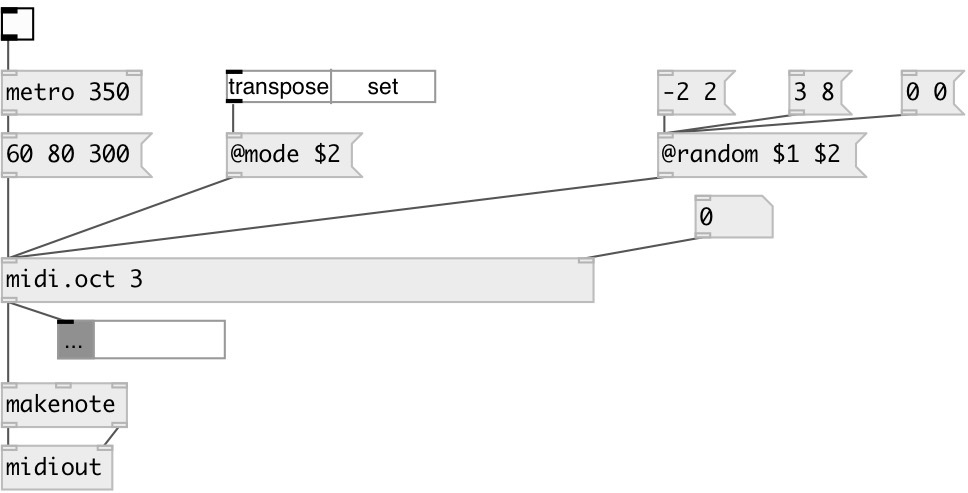

[index](index.html) :: [midi](category_midi.html)
---

# midi.oct

###### midi octave transpose

*доступно с версии:* 0.9.2

---

## аргументы:

* **OCT**
octave transposition 
_тип:_ int 

## свойства:

* **@oct** 
Запросить/установить octave transposition 
_тип:_ int 
_диапазон:_ -11..11 
_по умолчанию:_ 0 

* **@mode** 
Запросить/установить octave mode 
_тип:_ symbol 
_варианты:_ transpose, set 
_по умолчанию:_ transpose 

* **@set** 
Запросить/установить alias to @mode set 
_тип:_ alias 

* **@transpose** 
Запросить/установить alias to @mode transpose 
_тип:_ alias 

* **@random** 
Запросить/установить random octave range. Arguments are: MIN MAX. 
_тип:_ list 

## входы:

* note value 
_тип:_ control
* set @oct value 
_тип:_ control

## выходы:

* transposed NOTE VELOCITY [DUR] list 
_тип:_ control

## ключевые слова:

[midi](keywords/midi.html)
[octave](keywords/octave.html)
[transpose](keywords/transpose.html)

**Авторы:** Serge Poltavsky

**Лицензия:** GPL3 or later

