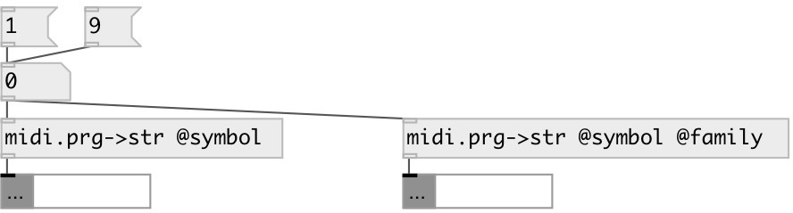

[index](index.html) :: [midi](category_midi.html)
---

# midi.prg2str

###### convert GM Instrument number to name (string or symbol)

*доступно с версии:* 0.4

---

## свойства:

* **@symbol** (initonly)
Запросить/установить output as symbol instead of string by default 
_тип:_ flag 
_по умолчанию:_ 0 

* **@family** (initonly)
Запросить/установить output family name instead of instrument name 
_тип:_ flag 
_по умолчанию:_ 0 

## входы:

* General MIDI instrument number [1-128] 
_тип:_ control

## выходы:

* output General MIDI instrument name (string or symbol) 
_тип:_ control

## ключевые слова:

[midi](keywords/midi.html)
[convert](keywords/convert.html)
[midi](keywords/midi.html)

**Авторы:** Serge Poltavsky

**Лицензия:** GPL3 or later

