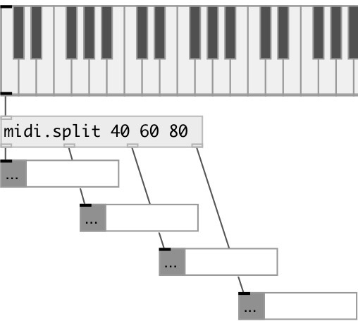

[index](index.html) :: [midi](category_midi.html)
---

# midi.split

###### midi note splitter

*доступно с версии:* 0.9.5

---

## информация
Split midi note messages at specified pitch values

## аргументы:

* **NOTES**
list of note values (split points) 
_тип:_ list 

## свойства:

* **@points** (readonly)
Запросить split points. Should be in strict ascending order 
_тип:_ list 

## входы:

* NOTE VELOCITY [DUR] list 
_тип:_ control

## выходы:

* midi pitches that are less than first split point 
_тип:_ control
* ... 
_тип:_ control
* midi pitches that are greater or equal than N-th split point and less then N+1 
_тип:_ control
* notes that are greater or equal last split point 
_тип:_ control

## ключевые слова:

[midi](keywords/midi.html)
[note](keywords/note.html)
[splitter](keywords/splitter.html)

**Авторы:** Serge Poltavsky

**Лицензия:** GPL3 or later

