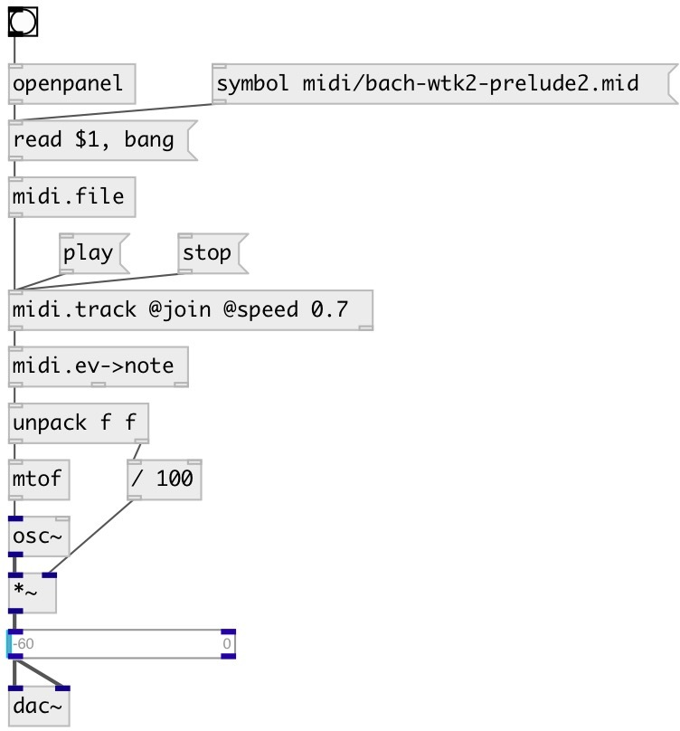

[index](index.html) :: [midi](category_midi.html)
---

# midi.track

###### extract track from MidiFile

*доступно с версии:* 0.4

---

## методы:

* **play**
start playing 

* **pause**
pause playing 

* **stop**
stop playing 

* **next**
moves playing position to next event. No output 

* **reset**
set current event index to zero 

* **seek**
seek to specified tick 

## свойства:

* **@track** 
Получить/установить track number 
_тип:_ int 
_минимальное значение:_ 0 
_по умолчанию:_ 0 

* **@join** 
Получить/установить join all tracks into one 
_тип:_ flag 
_по умолчанию:_ 0 

* **@speed** 
Получить/установить play speed factor 
_тип:_ float 
_минимальное значение:_ 0.01 
_по умолчанию:_ 1 

* **@tempo** (readonly)
Получить current tempo in TPQ 
_тип:_ int 
_по умолчанию:_ 120 

* **@current** (readonly)
Получить current event tick index 
_тип:_ int 
_по умолчанию:_ 0 

* **@nevents** (readonly)
Получить number of events in track 
_тип:_ int 
_по умолчанию:_ 0 

* **@state** (readonly)
Получить current state. 0: stopped, 1: playing, 2: paused 
_тип:_ int 
_варианты:_ 0, 1, 2 
_по умолчанию:_ 0 

## входы:

* method inlet 
_тип:_ control

## выходы:

* outputs MidiEvent message 
_тип:_ control
* time in milliseconds until next MIDI event 
_тип:_ control

## ключевые слова:

[midi](keywords/midi.html)
[track](keywords/track.html)

**Авторы:** Serge Poltavsky

**Лицензия:** GPL3 or later

