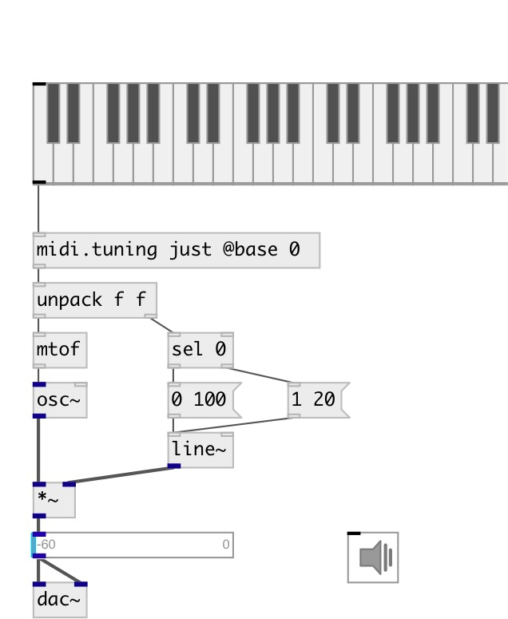

[index](index.html) :: [midi](category_midi.html)
---

# midi.tuning

###### apply tuning to midi messages

*доступно с версии:* 0.9.1

---

## аргументы:

* **LIST**
if symbol - set named temperament deviations, valid names are: &#34;eq&#34;, &#34;just&#34;,
&#34;ganassi&#34;, &#34;meantone&#34;, &#34;kirnberger3&#34;, &#34;pythagorean&#34;, &#34;rameau&#34;, &#34;valotti&#34; or
&#34;zarlino&#34;. If list: set deviation in cents per pitch 
_тип:_ list 

## свойства:

* **@base** 
Получить/установить base pitch (C: 0, A: 9, etc..) 
_тип:_ int 
_диапазон:_ 0..11 
_по умолчанию:_ 9 

* **@dev** 
Получить/установить list of deviations in cents 
_тип:_ list 
_по умолчанию:_ 0 0 0 0 0 0 0 0 0 0 0 0 

## входы:

* NOTE VELOCITY pair expected 
_тип:_ control

## выходы:

* note velocity pair 
_тип:_ control

## ключевые слова:

[midi](keywords/midi.html)
[tuning](keywords/tuning.html)

**Авторы:** Serge Poltavsky

**Лицензия:** GPL3 or later

