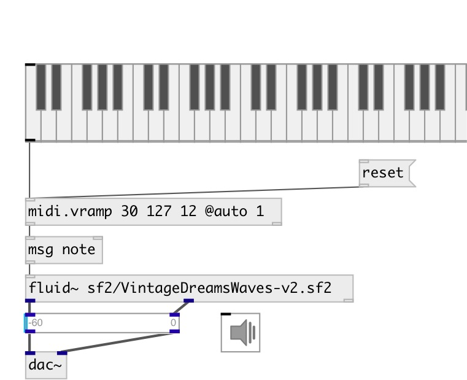

[index](index.html) :: [midi](category_midi.html)
---

# midi.vramp

###### apply crescendo or diminuendo for midi message flow

*доступно с версии:* 0.9.1

---

## аргументы:

* **FROM**
start value 
_тип:_ int 

* **TO**
end value 
_тип:_ int 

* **N**
number of steps 
_тип:_ int 

## методы:

* **reset**
reset to start value 

## свойства:

* **@from** 
Получить/установить start value 
_тип:_ int 
_диапазон:_ 0..127 
_по умолчанию:_ 127 

* **@to** 
Получить/установить end value 
_тип:_ int 
_диапазон:_ 0..127 
_по умолчанию:_ 127 

* **@n** 
Получить/установить number of steps 
_тип:_ int 
_минимальное значение:_ 0 
_по умолчанию:_ 0 

* **@auto** 
Получить/установить auto reset mode. If true: reset to @start value after ramp is finished 
_тип:_ int 
_варианты:_ 0, 1 
_по умолчанию:_ 0 

## входы:

* if VALUE &gt;0, treat as (VALUE 127) list, otherwise as (-VALUE, 0) 
_тип:_ control

## выходы:

* outputs NOTE VELOCITY pair 
_тип:_ control
* bang when destination value is reached 
_тип:_ control

## ключевые слова:

[midi](keywords/midi.html)
[ramp](keywords/ramp.html)
[crescendo](keywords/crescendo.html)
[diminuendo](keywords/diminuendo.html)

**Авторы:** Serge Poltavsky

**Лицензия:** GPL3 or later

