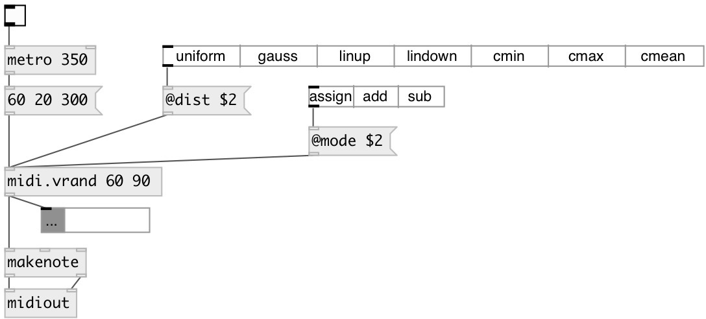

[index](index.html) :: [midi](category_midi.html)
---

# midi.vrand

###### midi velocity randomizer

*доступно с версии:* 0.9.2

---

## аргументы:

* **MIN**
min random range 
_тип:_ float 

* **MAX**
max random range 
_тип:_ float 

## свойства:

* **@min** 
Получить/установить min random range 
_тип:_ float 
_по умолчанию:_ 0 

* **@max** 
Получить/установить max random range 
_тип:_ float 
_по умолчанию:_ 127 

* **@seed** 
Получить/установить random seed 
_тип:_ int 
_минимальное значение:_ 0 
_по умолчанию:_ 0 

* **@mode** 
Получить/установить assign mode. If *assign* - replace origin velocity with random new one
(default), if *add* - adds random value to origin velocity, if *sub* - subtract
random value from origin velocity. 
_тип:_ symbol 
_варианты:_ assign, add, sub 
_по умолчанию:_ assign 

* **@add** 
Получить/установить alias to @mode add 
_тип:_ alias 

* **@sub** 
Получить/установить alias to @mode sub 
_тип:_ alias 

* **@assign** 
Получить/установить alias to @mode assign 
_тип:_ alias 

* **@dist** 
Получить/установить random distribution. *uniform* - generate uniformly distributed value, *gauss*
- mean=(@max+@min)/2, sigma=(@max-@max)/3, *linup* - linear distribution with
prob=0 at @min and prob=1 at @max, *lindown* - linear distribution with prob=1
at @min and prob=0 at @max, *cmin* - constant @min value, *cmax* - constant
@max value, *cmean* - constant (@max+@min)/2 value 
_тип:_ symbol 
_варианты:_ uniform, gauss, linup, lindown, cmin, cmax, cmean 
_по умолчанию:_ uniform 

## входы:

* note value 
_тип:_ control

## выходы:

* outputs NOTE VELOCITY [DUR] list with randomized VELOCITY value 
_тип:_ control

## ключевые слова:

[midi](keywords/midi.html)
[velocity](keywords/velocity.html)
[random](keywords/random.html)

**Авторы:** Serge Poltavsky

**Лицензия:** GPL3 or later

