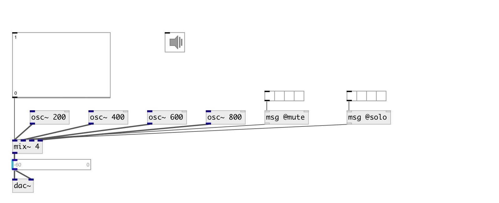

[index](index.html) :: [base](category_base.html)
---

# mix~

###### multislot signal mixer

*доступно с версии:* 0.6

---

## аргументы:

* **N**
number of inputs 
_тип:_ int 

## методы:

* **mute**
mute specified channel 
  __параметры:__
  - **CH** channel index (from 0) 
    тип: int  
    обязательно: True  

  - **VAL** 1 - mute, 0 - unmute 
    тип: int  
    обязательно: True  

* **solo**
solo (mute all others that not solo) specified channel 
  __параметры:__
  - **CH** channel index (from 0) 
    тип: int  
    обязательно: True  

  - **[VAL]** 1 - enable solo, 0 - disable solo 
    тип: int  

## свойства:

* **@xfade_time** 
Получить/установить smooth time 
_тип:_ float 
_единица:_ ms 
_минимальное значение:_ 1 
_по умолчанию:_ 20 

* **@value** 
Получить/установить linear amplitude values 
_тип:_ list 
_минимальное значение:_ 0 
_по умолчанию:_ 0 0 

* **@db** 
Получить/установить amplitude values in decibels 
_тип:_ list 
_единица:_ db 
_минимальное значение:_ -144 
_по умолчанию:_ -144 -144 

* **@mute** 
Получить/установить mute channel list, allowed values: 0, 1 
_тип:_ list 
_по умолчанию:_ 0 0 

* **@solo** 
Получить/установить solo channel list, allowed values: 0, 1 
_тип:_ list 
_по умолчанию:_ 0 0 

## входы:

* input signal 
_тип:_ audio
* input signal 
_тип:_ audio
* input signal 
_тип:_ audio

## выходы:

* output mixed signal 
_тип:_ audio

## ключевые слова:

[mix](keywords/mix.html)
[amplitude](keywords/amplitude.html)
[decibel](keywords/decibel.html)

**Авторы:** Serge Poltavsky

**Лицензия:** GPL3 or later

