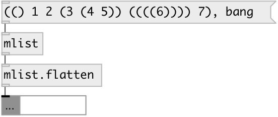

[index](index.html) :: [data](category_data.html)
---

# mlist.flatten

###### flatten nested mlist

*доступно с версии:* 0.6

---

## входы:

* list of mlists 
_тип:_ control

## выходы:

* mlist output 
_тип:_ control

## ключевые слова:

[flatten](keywords/flatten.html)
[list](keywords/list.html)

**Смотрите также:**
[\[data.mlist\]](data.mlist.html)

**Авторы:** Serge Poltavsky

**Лицензия:** GPL3 or later

