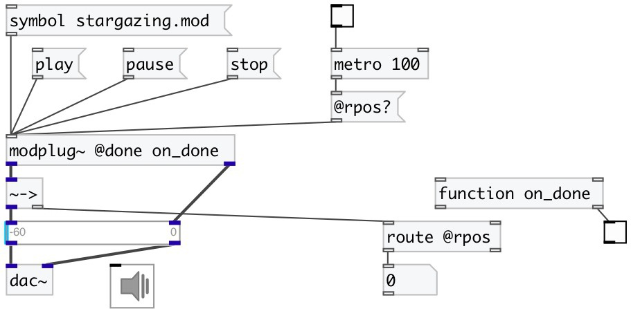

[index](index.html) :: [misc](category_misc.html)
---

# modplug~

###### MOD file player (using libmodplug)

*доступно с версии:* 0.4

---

## методы:

* **pause**
pause playing 

* **play**
play mod file 

* **stop**
stop playing and move play position to the end of file 

## свойства:

* **@done** 
Запросить/установить function called with bang when playing is finished 
_тип:_ symbol 

* **@len** (readonly)
Запросить length of mod file 
_тип:_ float 
_единица:_ ms 
_по умолчанию:_ 0 

* **@name** (readonly)
Запросить mod name 
_тип:_ symbol 

* **@pos** 
Запросить/установить position in mod file 
_тип:_ float 
_единица:_ ms 
_по умолчанию:_ -1 

* **@rpos** 
Запросить/установить relative position in mod file 
_тип:_ float 
_диапазон:_ 0..1 
_по умолчанию:_ 0 

* **@play** 
Запросить/установить play state 
_тип:_ bool 
_по умолчанию:_ 0 

## входы:

* load mod file 
_тип:_ control

## выходы:

* left channel and property output 
_тип:_ audio
* right channel 
_тип:_ audio

## ключевые слова:

[mod](keywords/mod.html)
[player](keywords/player.html)

**Авторы:** Serge Poltavsky

**Лицензия:** GPL3 or later

