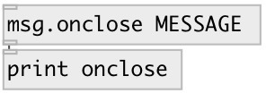

[index](index.html) :: [msg](category_msg.html)
---

# msg.onclose

###### send message when patch closes

*доступно с версии:* 0.9.7

---

## аргументы:

* **ARGS**
message. Comma separated messages are supported 
_тип:_ list 

## выходы:

* message output 
_тип:_ control

## ключевые слова:

[message](keywords/message.html)
[close](keywords/close.html)

**Смотрите также:**
[\[msg.onload\]](msg.onload.html)

**Авторы:** Serge Poltavsky

**Лицензия:** GPL3 or later

