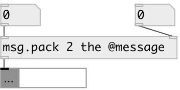

[index](index.html) :: [msg](category_msg.html)
---

# msg.pack

###### message pack

*доступно с версии:* 0.9.7

---

## аргументы:

* **N**
number of inputs 
_тип:_ int 

* **MSG**
message prefix 
_тип:_ list 

## свойства:

* **@n** (initonly)
Запросить/установить number of inlets 
_тип:_ int 
_диапазон:_ 1..32 
_по умолчанию:_ 2 

* **@sync** 
Запросить/установить sync mode. If true: output value on each inlet value change 
_тип:_ bool 
_по умолчанию:_ 0 

* **@msg** 
Запросить/установить message prefix. Change value via [prop.set] object 
_тип:_ list 

## входы:

* first atom 
_тип:_ control
* ... atom 
_тип:_ control
* n-th atom 
_тип:_ control

## выходы:

* message output 
_тип:_ control

## ключевые слова:

[message](keywords/message.html)
[pack](keywords/pack.html)

**Смотрите также:**
[\[msg\]](msg.html)

**Авторы:** Serge Poltavsky

**Лицензия:** GPL3 or later

