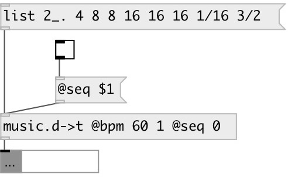

[index](index.html) :: [conv](category_conv.html)
---

# music.dur2time

###### convert duration list to time

*доступно с версии:* 0.9.4

---

## информация
duration can be specified - by denominator: 1 (whole), 2_. (dotted half), 8 (eight) etc. or - by ratio: 3/4 (three quaters), 1/8.(one dotted eight), 3/8 (three eights) etc.

## свойства:

* **@bpm** 
Запросить/установить tempo 
_тип:_ list 
_по умолчанию:_ 60 0.25 

* **@seq** 
Запросить/установить sequential durations 
_тип:_ bool 
_по умолчанию:_ 1 

## входы:

* duration list 
_тип:_ control

## выходы:

* converted value 
_тип:_ control

## ключевые слова:

[conv](keywords/conv.html)
[music](keywords/music.html)
[duration](keywords/duration.html)

**Авторы:** Serge Poltavsky

**Лицензия:** GPL3 or later

