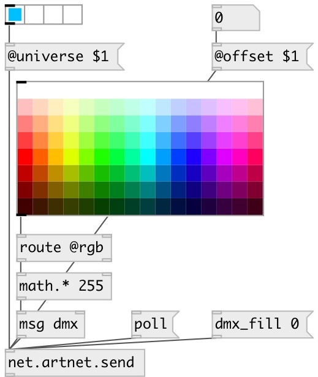

[index](index.html) :: [net](category_net.html)
---

# net.artnet.send

###### ArtNet DMX message sender

*доступно с версии:* 0.9.5

---

## аргументы:

* **UNIVERSE**
ArtNet universe 
_тип:_ int 

* **SUBNET**
ArtNet subnet 
_тип:_ int 

## методы:

* **blackout**
blackout (send 0 to all DMX channels) 

* **dmx**
set DMX channel values 
  __параметры:__
  - **VALUES** list of DMX values, first element sets first channel etc. 
    тип: list  
    обязательно: True  

* **dmx_fill**
set all DMX channels to given value 
  __параметры:__
  - **VAL** DMX value 
    тип: int  
    обязательно: True  

* **dmx_set**
set DMX channel value 
  __параметры:__
  - **CHAN** DMX channel 
    тип: int  
    обязательно: True  

  - **VAL** DMX value 
    тип: int  
    обязательно: True  

* **poll**
send poll request, dump response to Pd window 

## свойства:

* **@universe** 
Запросить/установить ArtNet universe 
_тип:_ int 
_диапазон:_ 0..15 
_по умолчанию:_ 0 

* **@subnet** 
Запросить/установить ArtNet subnet 
_тип:_ int 
_диапазон:_ 0..15 
_по умолчанию:_ 0 

* **@offset** 
Запросить/установить DMX channel offset 
_тип:_ int 
_диапазон:_ 0..511 
_по умолчанию:_ 0 

* **@ip** (initonly)
Запросить/установить bind interface IP address. If empty - use first available interface. 
_тип:_ symbol 

* **@rate** 
Запросить/установить send framerate 
_тип:_ float 
_единица:_ Hz 
_диапазон:_ 1..100 
_по умолчанию:_ 44 

* **@sync** 
Запросить/установить send mode. If true: send frame only when bang is received, otherwise send
frames with @rate speed with internal clock 
_тип:_ bool 
_по умолчанию:_ 0 

## входы:

* input 
_тип:_ control

## выходы:

* output 
_тип:_ control

## ключевые слова:

[osc](keywords/osc.html)
[net](keywords/net.html)
[artnet](keywords/artnet.html)
[dmx](keywords/dmx.html)

**Авторы:** Serge Poltavsky

**Лицензия:** GPL3 or later

