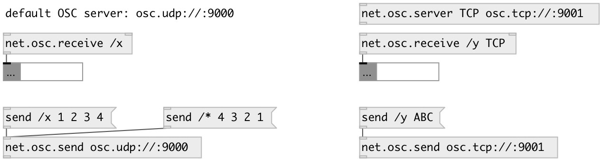

[index](index.html) :: [net](category_net.html)
---

# net.osc.receive

###### OSC message listener

*доступно с версии:* 0.9.5

---

## аргументы:

* **PATH**
OSC path to listen 
_тип:_ symbol 

* **SERVER**
OSC server name 
_тип:_ symbol 

* **TYPES**
expected OSC type string 
_тип:_ symbol 

## свойства:

* **@server** 
Запросить/установить OSC server name 
_тип:_ symbol 
_по умолчанию:_ default 

* **@path** 
Запросить/установить OSC listen path 
_тип:_ symbol 

* **@types** 
Запросить/установить expected OSC type string 
_тип:_ symbol 
_по умолчанию:_ none 

## входы:

* message input 
_тип:_ control
* set OSC listen path 
_тип:_ control

## выходы:

* OSC output 
_тип:_ control

## ключевые слова:

[osc](keywords/osc.html)
[net](keywords/net.html)
[receive](keywords/receive.html)

**Смотрите также:**
[\[net.osc.server\]](net.osc.server.html)
[\[net.osc.send\]](net.osc.send.html)

**Авторы:** Serge Poltavsky

**Лицензия:** GPL3 or later

