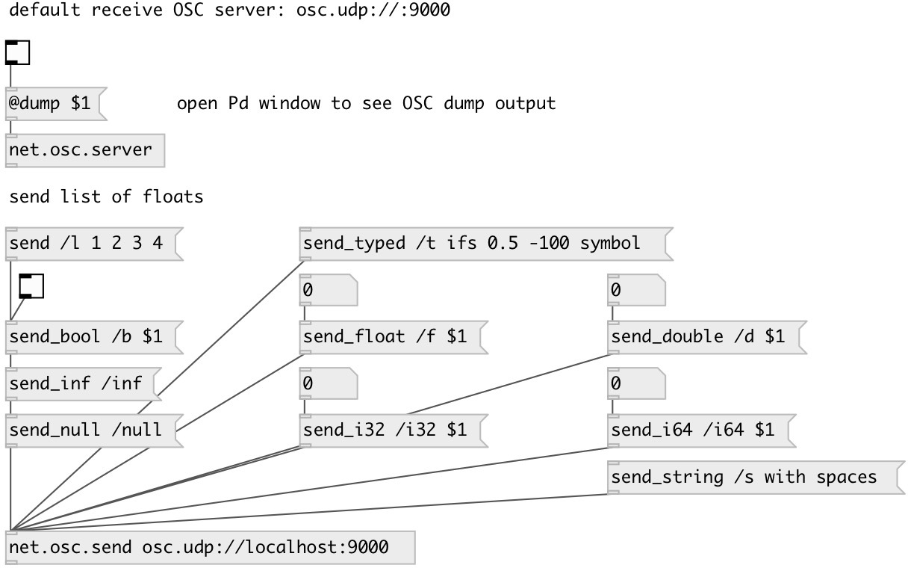

[index](index.html) :: [net](category_net.html)
---

# net.osc.send

###### OSC message sender

*доступно с версии:* 0.9.5

---

## аргументы:

* **NAME**
OSC server name (for using with other objects) 
_тип:_ symbol 

* **URL**
OSC server url (like osc.udp://localhost:12345) 
_тип:_ atom 

## методы:

* **send**
send input values (autotyped) 
  __параметры:__
  - **PATH** OSC path 
    тип: symbol  
    обязательно: True  

  - **VALUES** values 
    тип: list  
    обязательно: True  

* **send_bool**
send boolean value 
  __параметры:__
  - **PATH** OSC path 
    тип: symbol  
    обязательно: True  

  - **VAL** value 
    тип: int  
    обязательно: True  

* **send_i32**
send int32 value 
  __параметры:__
  - **PATH** OSC path 
    тип: symbol  
    обязательно: True  

  - **VAL** value 
    тип: int  
    обязательно: True  

* **send_i64**
send int64 value 
  __параметры:__
  - **PATH** OSC path 
    тип: symbol  
    обязательно: True  

  - **VAL** value 
    тип: int  
    обязательно: True  

* **send_float**
send float value 
  __параметры:__
  - **PATH** OSC path 
    тип: symbol  
    обязательно: True  

  - **VAL** value 
    тип: float  
    обязательно: True  

* **send_double**
send double value 
  __параметры:__
  - **PATH** OSC path 
    тип: symbol  
    обязательно: True  

  - **VAL** value 
    тип: float  
    обязательно: True  

* **send_null**
send null value 
  __параметры:__
  - **PATH** OSC path 
    тип: symbol  
    обязательно: True  

* **send_inf**
send inf value 
  __параметры:__
  - **PATH** OSC path 
    тип: symbol  
    обязательно: True  

* **send_string**
send string value 
  __параметры:__
  - **PATH** OSC path 
    тип: symbol  
    обязательно: True  

  - **VAL** value 
    тип: list  
    обязательно: True  

* **send_typed**
send list of typed values 
  __параметры:__
  - **PATH** OSC path 
    тип: symbol  
    обязательно: True  

  - **TYPES** type string, &#39;i&#39;: int32, &#39;f&#39;: 32-bit float, &#39;s&#39;: string, &#39;h&#39;: int64, &#39;d&#39;: 64-bit float, &#39;T&#39;: #true value, &#39;F&#39;: #false value, &#39;N&#39;: #null value, &#39;I&#39;: #inf value 
    тип: symbol  
    обязательно: True  

  - **VAL** values 
    тип: list  
    обязательно: True  

* **send_char**
send character 
  __параметры:__
  - **PATH** OSC path 
    тип: symbol  
    обязательно: True  

  - **VAL** ASCII code in 0-127 range or single symbol 
    тип: atom  
    обязательно: True  

* **send_blob**
send character 
  __параметры:__
  - **PATH** OSC path 
    тип: symbol  
    обязательно: True  

  - **VAL** list of bytes 
    тип: list  
    обязательно: True  

* **send_midi**
send midi message (4 bytes) 
  __параметры:__
  - **PATH** OSC path 
    тип: symbol  
    обязательно: True  

  - **VAL** hex symbol (0xAAFF1122) or list of 4 bytes 
    тип: list  
    обязательно: True  

## свойства:

* **@proto** (readonly)
Запросить sending protocol 
_тип:_ symbol 
_по умолчанию:_ udp 

* **@port** (readonly)
Запросить destination port 
_тип:_ int 
_по умолчанию:_ 0 

* **@host** (readonly)
Запросить destination host 
_тип:_ symbol 

* **@url** 
Запросить/установить destination url 
_тип:_ atom 

* **@path** (readonly)
Запросить socket filesystem path (if using unix proto) 
_тип:_ symbol 

## входы:

* message input 
_тип:_ control

## выходы:

* none 
_тип:_ control

## ключевые слова:

[osc](keywords/osc.html)
[net](keywords/net.html)
[send](keywords/send.html)

**Смотрите также:**
[\[net.osc.server\]](net.osc.server.html)
[\[net.osc.receive\]](net.osc.receive.html)

**Авторы:** Serge Poltavsky

**Лицензия:** GPL3 or later

