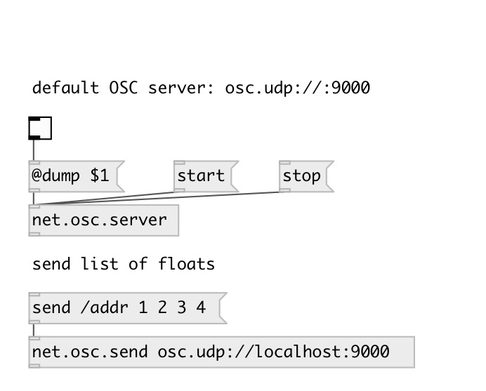

[index](index.html) :: [net](category_net.html)
---

# net.osc.server

###### OSC server control

*доступно с версии:* 0.9.5

---

## аргументы:

* **NAME**
OSC server name (for using with other objects) 
_тип:_ symbol 

* **URL**
OSC server url (like udp:12345), see @url property 
_тип:_ atom 

## методы:

* **start**
start OSC server 
  __параметры:__
  - **[VAL]** 1: start, 0: stop 
    тип: int  

* **stop**
stop OSC server 
  __параметры:__
  - **[VAL]** 1: stop, 0: start 
    тип: int  

## свойства:

* **@dump** 
Запросить/установить dump incoming messages to Pd window 
_тип:_ bool 
_по умолчанию:_ 0 

* **@auto_start** 
Запросить/установить automatically start on creation 
_тип:_ bool 
_по умолчанию:_ 1 

* **@url** (initonly)
Запросить/установить OSC server url in form: PROTO:PORT (udp:12345) or just PORT, or
osc.PROTO://:PORT (for ex. osc.tcp://:9001) 
_тип:_ atom 
_по умолчанию:_ udp:9000 

* **@name** (initonly)
Запросить/установить OSC server name 
_тип:_ symbol 
_по умолчанию:_ default 

* **@port** (readonly)
Запросить OSC server port 
_тип:_ int 
_по умолчанию:_ 9000 

* **@path** (readonly)
Запросить OSC server local socket path 
_тип:_ symbol 

* **@proto** (readonly)
Запросить OSC server proto (udp or tcp) 
_тип:_ symbol 
_по умолчанию:_ udp 

* **@host** (readonly)
Запросить OSC server host 
_тип:_ symbol 

## входы:

* ... 
_тип:_ control

## выходы:

* ... 
_тип:_ control

## ключевые слова:

[net](keywords/net.html)
[osc](keywords/osc.html)
[server](keywords/server.html)

**Смотрите также:**
[\[net.osc.send\]](net.osc.send.html)
[\[net.osc.receive\]](net.osc.receive.html)

**Авторы:** Serge Poltavsky

**Лицензия:** GPL3 or later

