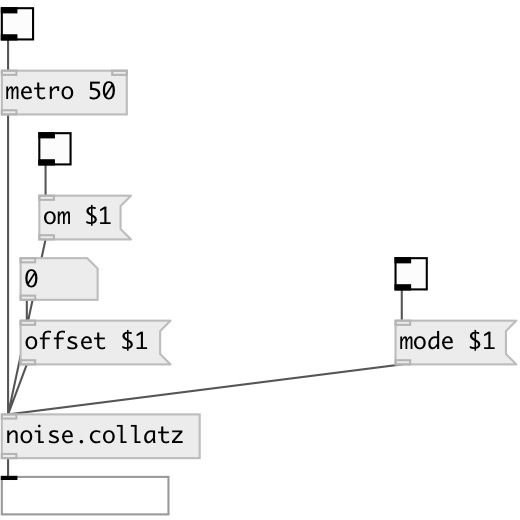

[index](index.html) :: [noise](category_noise.html)
---

# noise.collatz

###### Part of a-chaos library

*доступно с версии:* .5

---

## информация
Collatz conjecture output

## методы:

* **offset**
 
  __параметры:__
  - **OFFSET** offset value 
    тип: float  
    обязательно: True  

* **mode**
 
  __параметры:__
  - **MODE** mode value. 0 for Collatz, 1 for Terras 
    тип: int  
    обязательно: True  

* **om**
 
  __параметры:__
  - **OM** enables output when cut or fold value is changed 
    тип: int  
    обязательно: True  

## входы:

* output value 
_тип:_ control

## выходы:

* main outlet 
_тип:_ control

## ключевые слова:

[noise](keywords/noise.html)

**Авторы:** André Sier

**Лицензия:** %

