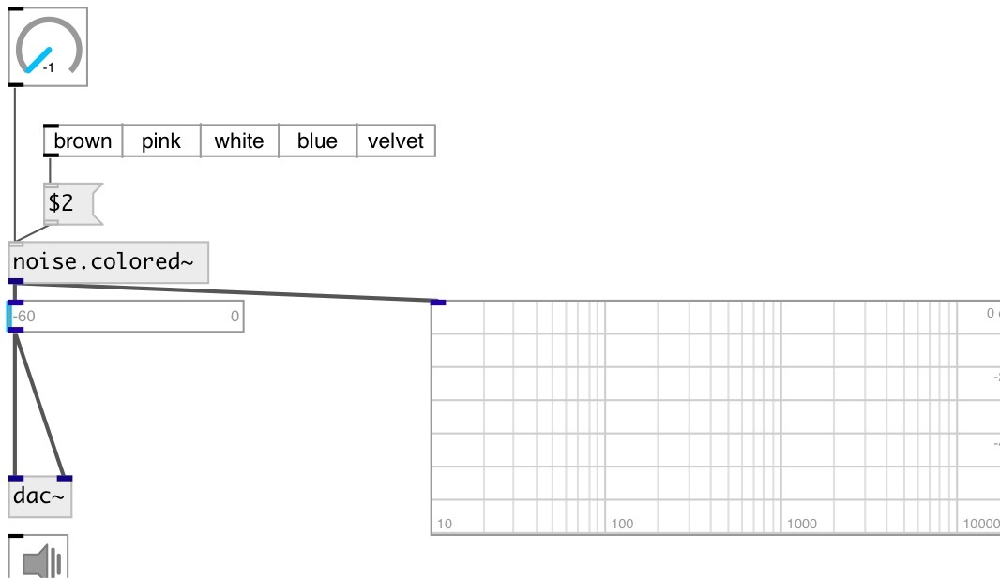

[index](index.html) :: [noise](category_noise.html)
---

# noise.colored~

###### colored noise generator with an arbitrary spectral roll

*доступно с версии:* 0.9.6

---

## информация
Generates a colored noise signal with an arbitrary spectral roll-off factor (alpha) over the entire audible frequency range (20-20000 Hz). The output is normalized so that an equal RMS level is maintained for different values of alpha.

## аргументы:

* **ALPHA**
slope of roll-off, between -1 and 1. -1 corresponds to brown/red noise, -1/2
pink noise, 0 white noise, 1/2 blue noise, and 1 violet/azure noise. 
_тип:_ float 

## свойства:

* **@alpha** 
Запросить/установить slope of roll-off, between -1 and 1. -1 corresponds to brown/red noise, -1/2
pink noise, 0 white noise, 1/2 blue noise, and 1 violet/azure noise. 
_тип:_ float 
_диапазон:_ -1..1 
_по умолчанию:_ 0 

* **@active** 
Запросить/установить on/off dsp processing 
_тип:_ bool 
_по умолчанию:_ 1 

## входы:

* set roll-off frequency 
_тип:_ control

## выходы:

* output signal 
_тип:_ audio

## ключевые слова:

[noise](keywords/noise.html)
[colored](keywords/colored.html)
[white](keywords/white.html)
[red](keywords/red.html)
[brown](keywords/brown.html)
[blue](keywords/blue.html)
[velvet](keywords/velvet.html)

**Авторы:** Serge Poltavsky

**Лицензия:** GPL3 or later

