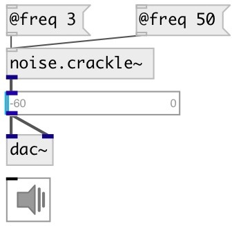

[index](index.html) :: [noise](category_noise.html)
---

# noise.crackle~

###### sparse noise generator

*доступно с версии:* 0.6

---

## информация
Random impulses in the amplitude range -1 to 1 are generated at an average rate of @freq impulses per second

## аргументы:

* **FREQ**
average frequency of noise impulses per second 
_тип:_ float 

## свойства:

* **@freq** 
Получить/установить average frequency of noise impulses per second 
_тип:_ float 
_единица:_ Hz 
_диапазон:_ 0..100 
_по умолчанию:_ 10 

* **@active** 
Получить/установить on/off dsp processing 
_тип:_ int 
_варианты:_ 0, 1 
_по умолчанию:_ 1 

## входы:

* set average frequency 
_тип:_ control

## выходы:

* output signal 
_тип:_ audio

## ключевые слова:

[noise](keywords/noise.html)
[crackle](keywords/crackle.html)

**Авторы:** Serge Poltavsky

**Лицензия:** GPL3 or later

