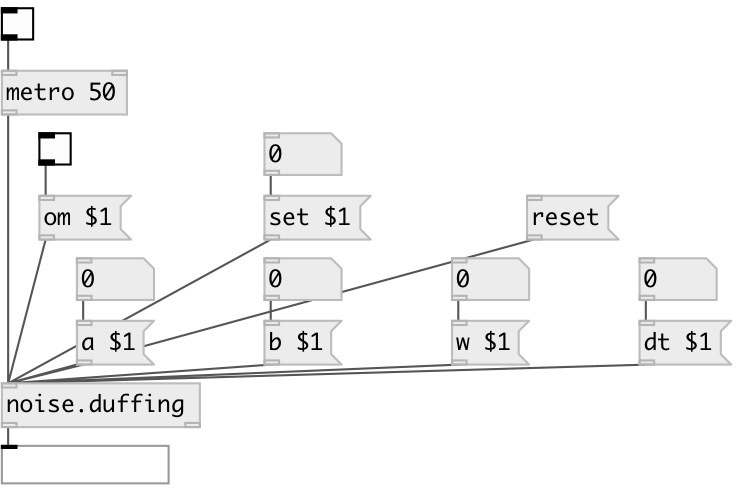

[index](index.html) :: [noise](category_noise.html)
---

# noise.duffing

###### Part of a-chaos library

*доступно с версии:* .5

---

## информация
Duffing Attractor Written by Paul Bourke March 1998 --- The solution to the Duffing equations is often used as an example of a classic chaotic system. The Duffing system of differential equations is: =========== dx / dt = y dy / dt = x - x3 - a y + b cos(w t) =================================== where typically, a = 0.25, b = 0.3, w = 1 The following shows a &#34;typical&#34; segment of (x,y) values.

## аргументы:

* **ARG0**
a value (default 0.25), optional 
_тип:_ float 

* **ARG1**
b value (default 0.3), optional 
_тип:_ float 

* **ARG2**
w value (default 1.0), optional 
_тип:_ float 

* **ARG3**
dt value (default 0.01), optional 
_тип:_ float 

## методы:

* **set**
 
  __параметры:__
  - **SET** set to value 
    тип: float  
    обязательно: True  

* **reset**
reset state 

* **om**
 
  __параметры:__
  - **OM** enables output when cut or fold value is changed 
    тип: int  
    обязательно: True  

* **a**
 
  __параметры:__
  - **A** a value 
    тип: float  
    обязательно: True  

* **b**
 
  __параметры:__
  - **B** b value 
    тип: float  
    обязательно: True  

* **w**
 
  __параметры:__
  - **W** w value 
    тип: float  
    обязательно: True  

* **dt**
 
  __параметры:__
  - **DT** dt value 
    тип: float  
    обязательно: True  

## входы:

* output value 
_тип:_ control

## выходы:

* main outlet 
_тип:_ control

## ключевые слова:

[noise](keywords/noise.html)

**Авторы:** Paul Bourke, André Sier

**Лицензия:** %

