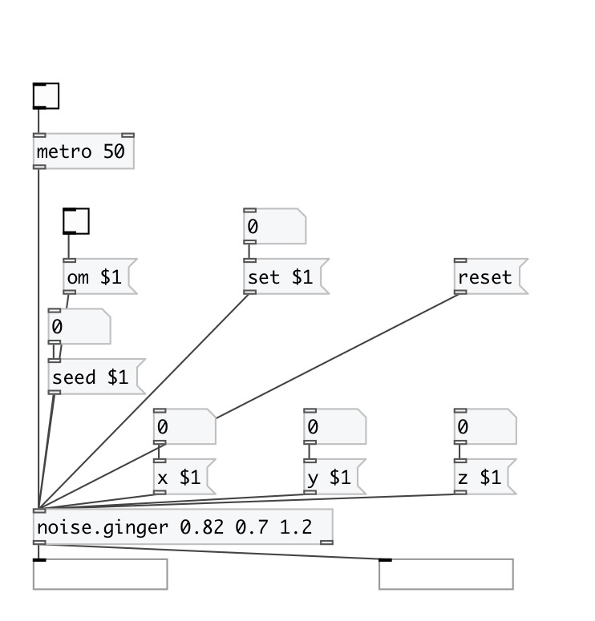

[index](index.html) :: [noise](category_noise.html)
---

# noise.ginger

###### Gingerbreadman map chaotic generator

*доступно с версии:* 0.1

---

## информация
A non-interpolating generator based on the difference equations: x(n+1) = 1 - y(n) + seed * |x(n)| y(n+1) = x(n)

## аргументы:

* **SEED**
seed value, default 0.82 
_тип:_ float 

* **X**
initial x value, default 0.7 
_тип:_ float 

* **Y**
initial y value, default 1.2 
_тип:_ float 

## методы:

* **reset**
reset seed, x and y values to defaults 

* **seed**
set seed value and update default 

* **set**
set seed, x and y values, updates defaults 

* **x**
set x value and update default 

* **y**
set y value and update default 

## входы:

* outputs current x/y values and generates new one 
_тип:_ control

## выходы:

* outputs x-value 
_тип:_ control
* outputs y-value 
_тип:_ control

## ключевые слова:

[chaos](keywords/chaos.html)
[generator](keywords/generator.html)
[gingerbreadman](keywords/gingerbreadman.html)

**Смотрите также:**
[\[chaos.gbman0\]](chaos.gbman0.html)

**Авторы:** André Sier

**Лицензия:** GPL3 or later

