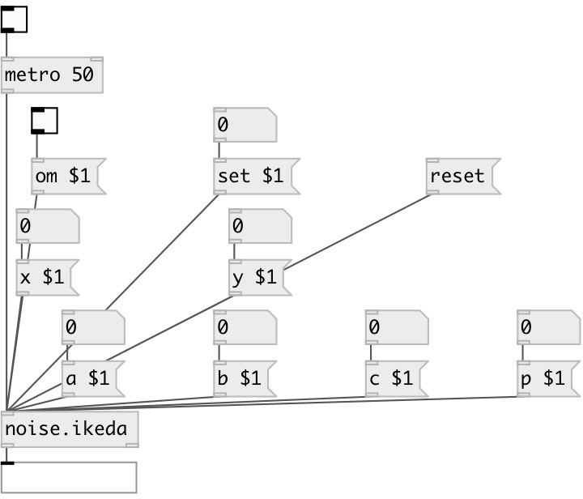

[index](index.html) :: [noise](category_noise.html)
---

# noise.ikeda

###### Ikeda attractor

*доступно с версии:* 0.5

---

## информация
Ikeda attractor z[n+1] = a + b*z[n]*exp(kj - pj/(1+|z[n]^2|)) where z is a complex number real number formula by euler returns: === x[n+1] = a + k*(x0*cos(t[n])) - y0*sin(t[n]) ) y[n+1] = k*(x0*sin(t[n])) - y0*cos(t[n]) === where t[n] = b - p/(1 + x[n]^2 + y[n]^2) a = 0.85, b = 0.9, k = 0.4, p = 7.7 a = 1.0, b = 0.9, k = 0.4, p = 6.0

## аргументы:

* **A**
a value (optional) 
_тип:_ float 

* **B**
b value (optional) 
_тип:_ float 

* **K**
k value (optional) 
_тип:_ float 

* **P**
p value (optional) 
_тип:_ float 

* **NX**
nx value (optional) 
_тип:_ float 

* **NY**
ny value (optional) 
_тип:_ float 

## методы:

* **set**
 
  __параметры:__
  - **SET** set to value 
    тип: float  
    обязательно: True  

* **reset**
reset state 

* **om**
 
  __параметры:__
  - **OM** enables output when cut or fold value is changed 
    тип: int  
    обязательно: True  

* **a**
 
  __параметры:__
  - **A** a value 
    тип: float  
    обязательно: True  

* **b**
 
  __параметры:__
  - **B** b value 
    тип: float  
    обязательно: True  

* **c**
 
  __параметры:__
  - **K** k value (note the &#34;c&#34; method in original a-chaos library) 
    тип: float  
    обязательно: True  

* **p**
 
  __параметры:__
  - **P** p value 
    тип: float  
    обязательно: True  

* **x**
 
  __параметры:__
  - **NX** x value 
    тип: float  
    обязательно: True  

* **y**
 
  __параметры:__
  - **NY** y value 
    тип: float  
    обязательно: True  

## входы:

* output value 
_тип:_ control

## выходы:

* x outlet 
_тип:_ control
* y outlet 
_тип:_ control

## ключевые слова:

[noise](keywords/noise.html)

**Авторы:** André Sier

**Лицензия:** %

