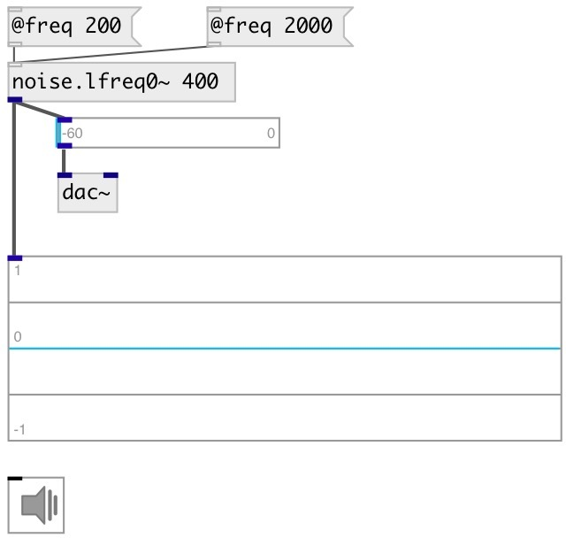

[index](index.html) :: [noise](category_noise.html)
---

# noise.lfreq0~

###### sampled/held noise (piecewise constant)

*доступно с версии:* 0.6

---

## информация
new random number every int(SR/freq) samples or so

## аргументы:

* **FREQ**
noise generation freq 
_тип:_ float 
_единица:_ Hz 

## свойства:

* **@freq** 
Запросить/установить noise generation freq. New random number every int(SR/freq) 
_тип:_ float 
_единица:_ Hz 
_диапазон:_ 0.5..22050 
_по умолчанию:_ 1000 

* **@active** 
Запросить/установить on/off dsp processing 
_тип:_ bool 
_по умолчанию:_ 1 

* **@osc** (initonly)
Запросить/установить OSC server name to listen 
_тип:_ symbol 

* **@id** (initonly)
Запросить/установить OSC address id. If specified, bind all properties to /ID/noise_lfreq0/PROP_NAME
osc address, if empty bind to /noise_lfreq0/PROP_NAME. 
_тип:_ symbol 

## входы:

* set average frequency 
_тип:_ control

## выходы:

* output signal 
_тип:_ audio

## ключевые слова:

[noise](keywords/noise.html)
[white](keywords/white.html)

**Смотрите также:**
[\[noise.lfreq~\]](noise.lfreq~.html)

**Авторы:** Serge Poltavsky

**Лицензия:** GPL3 or later

