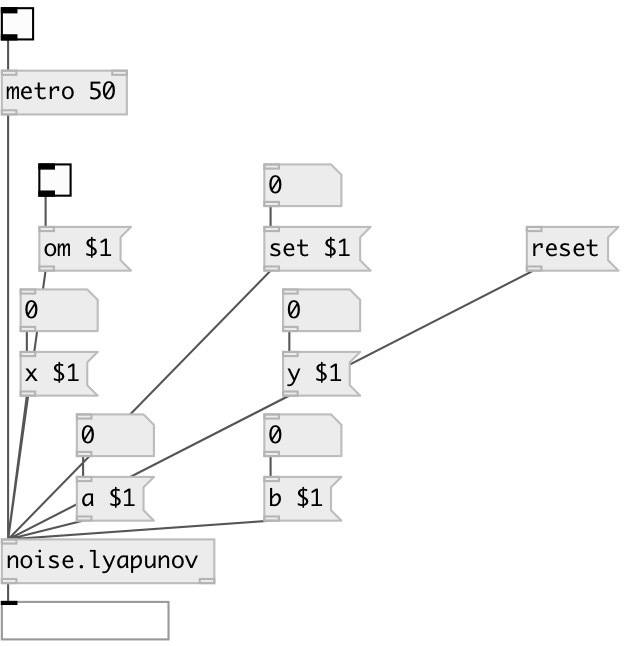

[index](index.html) :: [noise](category_noise.html)
---

# noise.lyapunov

###### lyapunov random attractor

*доступно с версии:* 0.5

---

## информация
inspired by Paul Bourke, implementation by André Sier --- lyapunov random attractors --- Paul Bourke&#39;s words http://astronomy.swin.edu.au/%7Epbourke/fractals/lyapunov/ --- On average 98% of the random selections of (an, bn) result in an infinite series. This is so common because of the range (-2&lt;=a, b&lt;=2) for each of the parameters a and b, the number of infinite cases will reduce greatly with a smaller range. About 1% were point attractors, and about 0.5% were periodic basins of attraction. === x[n+1] = a[0] + a[1]*x[n] + a[2]*x[n]^2 + a[3]*x[n]*y[n] + a[4]*y[n] + a[5]*y[n]^2 y[n+1] = b[0] + b[1]*x[n] + b[2]*x[n]^2 + b[3]*x[n]*y[n] + b[4]*y[n] + b[5]*y[n]^2 ===

## аргументы:

* **A**
a value (optional) 
_тип:_ float 

* **B**
b value (optional) 
_тип:_ float 

* **X**
x value (optional) 
_тип:_ float 

* **Y**
y value (optional) 
_тип:_ float 

## методы:

* **a**
 
  __параметры:__
  - **A0** a[0] value 
    тип: float  
    обязательно: True  

  - **[A1]** a[1] value 
    тип: float  

  - **[A2]** a[2] value 
    тип: float  

  - **[A3]** a[3] value 
    тип: float  

  - **[A4]** a[4] value 
    тип: float  

  - **[A5]** a[5] value 
    тип: float  

* **b**
 
  __параметры:__
  - **B0** b[0] value 
    тип: float  
    обязательно: True  

  - **[B1]** b[1] value 
    тип: float  

  - **[B2]** b[2] value 
    тип: float  

  - **[B3]** b[3] value 
    тип: float  

  - **[B4]** b[4] value 
    тип: float  

  - **[B5]** b[5] value 
    тип: float  

* **om**
 
  __параметры:__
  - **OM** enables output when cut or fold value is changed 
    тип: int  
    обязательно: True  

* **reset**
reset state 

* **set**
 
  __параметры:__
  - **SET** set to value 
    тип: float  
    обязательно: True  

* **x**
 
  __параметры:__
  - **NX** x value 
    тип: float  
    обязательно: True  

* **y**
 
  __параметры:__
  - **NY** y value 
    тип: float  
    обязательно: True  

## входы:

* output value 
_тип:_ control

## выходы:

* x outlet 
_тип:_ control
* y outlet 
_тип:_ control

## ключевые слова:

[noise](keywords/noise.html)

**Авторы:** André Sier

**Лицензия:** %

