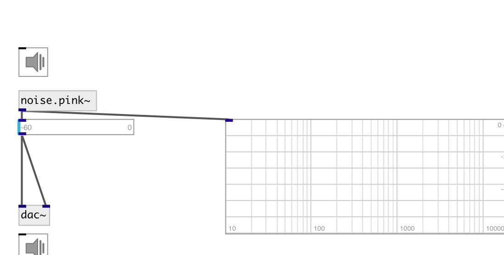

[index](index.html) :: [noise](category_noise.html)
---

# noise.pink~

###### Pink noise generator

*доступно с версии:* 0.1

---

## информация
Pink noise or 1/f noise is a signal or process with a frequency spectrum such that the power spectral density (energy or power per frequency interval) is inversely proportional to the frequency of the signal. In pink noise, each octave (halving/doubling in frequency) carries an equal amount of noise energy. The name arises from the pink appearance of visible light with this power spectrum.

## свойства:

* **@active** 
Получить/установить on/off dsp processing 
_тип:_ int 
_варианты:_ 0, 1 
_по умолчанию:_ 1 

## выходы:

* output signal 
_тип:_ audio

## ключевые слова:

[noise](keywords/noise.html)
[pink](keywords/pink.html)

**Смотрите также:**
[\[noise.white~\]](noise.white~.html)

**Авторы:** Serge Poltavsky

**Лицензия:** GPL3 or later

