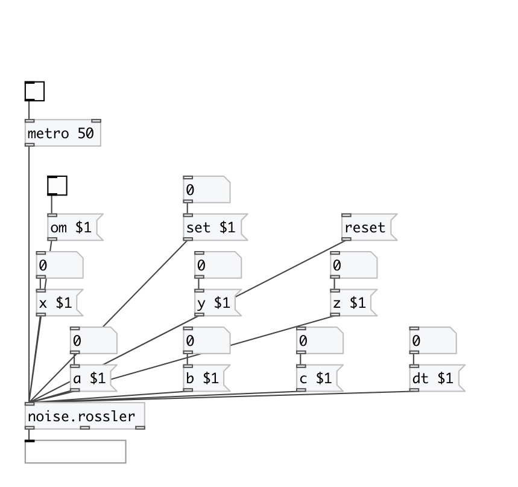

[index](index.html) :: [noise](category_noise.html)
---

# noise.rossler

###### Rössler attractor

*доступно с версии:* 0.5

---

## информация
Heuns&#39; method

## аргументы:

* **X**
x value (optional) 
_тип:_ float 

* **Y**
y value (optional) 
_тип:_ float 

* **Z**
z value (optional) 
_тип:_ float 

* **A**
a value (optional) 
_тип:_ float 

* **B**
b value (optional) 
_тип:_ float 

* **C**
c value (optional) 
_тип:_ float 

* **DT**
dt value (optional) 
_тип:_ float 

## методы:

* **set**
 
  __параметры:__
  - **SET** set to value 
    тип: float  
    обязательно: True  

* **reset**
reset state 

* **om**
 
  __параметры:__
  - **OM** enables output when cut or fold value is changed 
    тип: int  
    обязательно: True  

* **a**
 
  __параметры:__
  - **A** a value 
    тип: float  
    обязательно: True  

* **b**
 
  __параметры:__
  - **B** b value 
    тип: float  
    обязательно: True  

* **c**
 
  __параметры:__
  - **C** c value 
    тип: float  
    обязательно: True  

* **dt**
 
  __параметры:__
  - **D** dt value 
    тип: float  
    обязательно: True  

* **x**
 
  __параметры:__
  - **NX** x value 
    тип: float  
    обязательно: True  

* **y**
 
  __параметры:__
  - **NY** y value 
    тип: float  
    обязательно: True  

* **z**
 
  __параметры:__
  - **NZ** z value 
    тип: float  
    обязательно: True  

## входы:

* output value 
_тип:_ control

## выходы:

* x outlet 
_тип:_ control
* y outlet 
_тип:_ control
* z outlet 
_тип:_ control

## ключевые слова:

[noise](keywords/noise.html)

**Авторы:** André Sier

**Лицензия:** %

