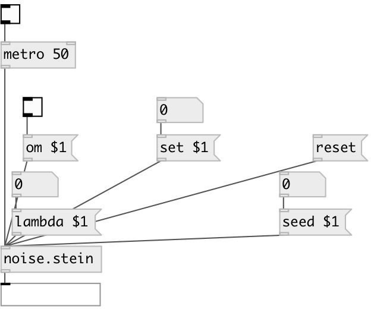

[index](index.html) :: [noise](category_noise.html)
---

# noise.stein

###### Stein distribution

*доступно с версии:* 0.5

---

## информация
Stein distribution

## аргументы:

* **ARG0**
a value (optional) 
_тип:_ float 

* **ARG1**
b value (optional) 
_тип:_ float 

* **ARG2**
x value (optional) 
_тип:_ float 

* **ARG3**
y value (optional) 
_тип:_ float 

## методы:

* **lambda**
 
  __параметры:__
  - **LAMBDA** lambda value 
    тип: float  
    обязательно: True  

* **om**
 
  __параметры:__
  - **OM** enables output when cut or fold value is changed 
    тип: int  
    обязательно: True  

* **reset**
reset state 

* **seed**
 
  __параметры:__
  - **SEED** seed value 
    тип: float  
    обязательно: True  

* **set**
 
  __параметры:__
  - **SET** set to value 
    тип: float  
    обязательно: True  

## входы:

* output value 
_тип:_ control

## выходы:

* main outlet 
_тип:_ control

## ключевые слова:

[noise](keywords/noise.html)

**Авторы:** André Sier

**Лицензия:** %

