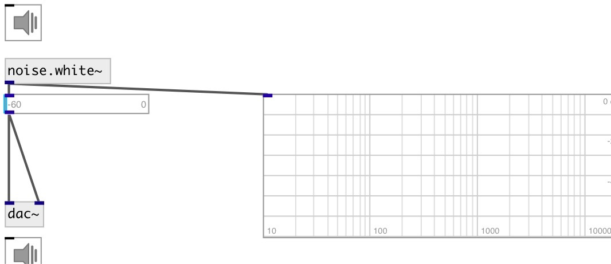

[index](index.html) :: [noise](category_noise.html)
---

# noise.white~

###### White noise generator

*доступно с версии:* 0.1

---

## информация
outputs random numbers between -1 and 1 at signal rate.

## свойства:

* **@active** 
Запросить/установить on/off dsp processing 
_тип:_ bool 
_по умолчанию:_ 1 

## выходы:

* output signal 
_тип:_ audio

## ключевые слова:

[noise](keywords/noise.html)
[white](keywords/white.html)

**Смотрите также:**
[\[noise.pink~\]](noise.pink~.html)

**Авторы:** Serge Poltavsky

**Лицензия:** GPL3 or later

